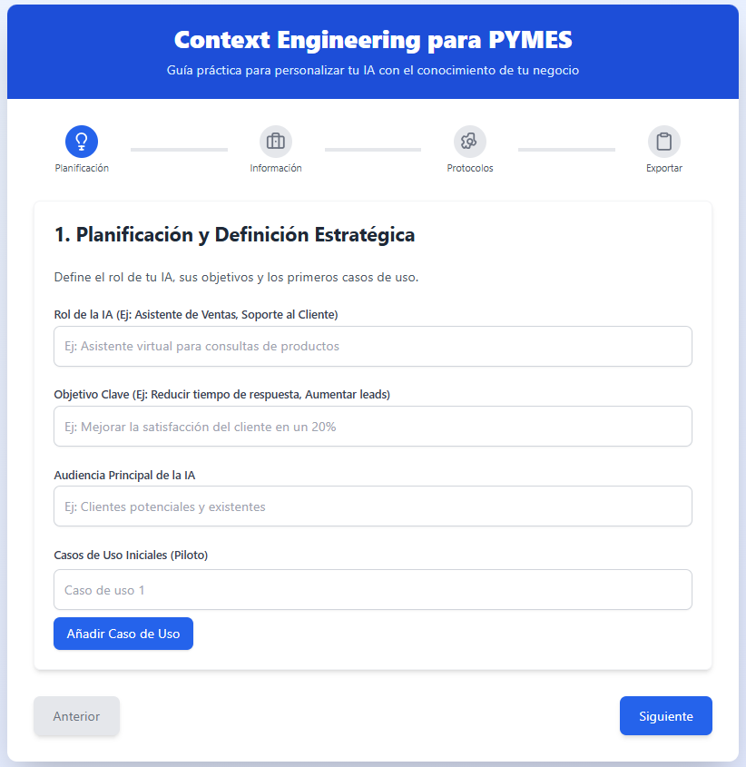

# Context Engineering Framework para PYMES

Esta es una aplicación de React diseñada como una herramienta interactiva para ayudar a las Pequeñas y Medianas Empresas (PYMES) a construir un prompt de contexto estructurado para sus asistentes de Inteligencia Artificial. El objetivo es guiar al usuario a través de un proceso paso a paso para definir el conocimiento, la personalidad y las reglas operativas de su IA, generando un prompt listo para ser usado en plataformas como ChatGPT, Gemini, etc.

## Visión General del Proyecto

La ingeniería de contexto es el proceso de proporcionar a un modelo de lenguaje grande (LLM) la información y las directrices necesarias para que actúe de manera consistente, precisa y alineada con la identidad de una marca o empresa. Esta herramienta simplifica dicho proceso para las PYMES, dividiéndolo en cuatro fases manejables.

 <!-- Se recomienda añadir una captura de pantalla del producto final -->

### Fases de la Herramienta

1.  **Planificación y Definición Estratégica:**
    *   **Rol de la IA:** ¿Qué función cumplirá? (Ej: Asistente de Ventas, Soporte Técnico Nivel 1).
    *   **Objetivo Clave:** ¿Qué se espera que logre la IA? (Ej: Reducir el tiempo de respuesta, calificar leads).
    *   **Audiencia Principal:** ¿A quién se dirigirá la IA?
    *   **Casos de Uso:** Definición de las tareas específicas que manejará la IA.

2.  **Recopilación y Estructuración de Información:**
    *   **Base de Conocimiento:** Se recopila información vital de la empresa, como misión, visión, descripción de productos/servicios, FAQs y procesos clave.

3.  **Diseño de Protocolos de Contexto (MCP):**
    *   **Personalidad de la IA:** Se ajustan los rasgos de la personalidad (formal, amigable, directo, etc.) a través de deslizadores.
    *   **Reglas de Comunicación:** Se establecen directrices claras sobre qué **HACER** y qué **NO HACER**.
    *   **Reglas de Escalada:** Se definen los escenarios en los que la IA debe derivar la conversación a un agente humano.

4.  **Revisión y Exportación:**
    *   La herramienta consolida toda la información en un prompt de sistema cohesivo.
    *   El usuario puede revisar el prompt generado y copiarlo con un solo clic para implementarlo en su plataforma de IA.

---

## Cómo Empezar

Para ejecutar este proyecto localmente, sigue estos pasos:

### Prerrequisitos

-   Node.js (versión 14 o superior)
-   npm (generalmente viene con Node.js)

### Instalación

1.  **Clona el repositorio (o descarga los archivos):**
    ```bash
    git clone https://github.com/tu-usuario/ce_framework.git
    cd ce_framework
    ```

2.  **Instala las dependencias del proyecto:**
    ```bash
    npm install
    ```

### Ejecución

1.  **Inicia la aplicación en modo de desarrollo:**
    ```bash
    npm start
    ```
    Esto abrirá la aplicación en tu navegador en `http://localhost:3000`.

2.  **Navega por los pasos:**
    Usa los botones "Siguiente" y "Anterior" para moverte a través de las cuatro fases de la herramienta.

3.  **Genera y copia tu prompt:**
    Al llegar al paso 4, la aplicación te mostrará el prompt completo. Usa el botón "Copiar" para guardarlo en tu portapapeles.

---

## Scripts Disponibles

En el directorio del proyecto, puedes ejecutar:

-   `npm start`: Inicia la aplicación en modo de desarrollo.
-   `npm run build`: Compila la aplicación para producción en la carpeta `build`.
-   `npm test`: Inicia el corredor de pruebas en modo interactivo.
-   `npm run eject`: Expulsa la configuración de Create React App. **Nota: esta es una operación irreversible.**

## Tecnologías Utilizadas

-   **React:** Biblioteca principal para la construcción de la interfaz de usuario.
-   **React Hooks (`useState`, `useEffect`):** Para la gestión del estado y los efectos secundarios.
-   **Create React App:** Para la configuración inicial y los scripts del proyecto.
-   **CSS:** Estilos personalizados para la apariencia de la aplicación (se recomienda migrar a una solución como Tailwind CSS o Styled Components para mayor escalabilidad).
